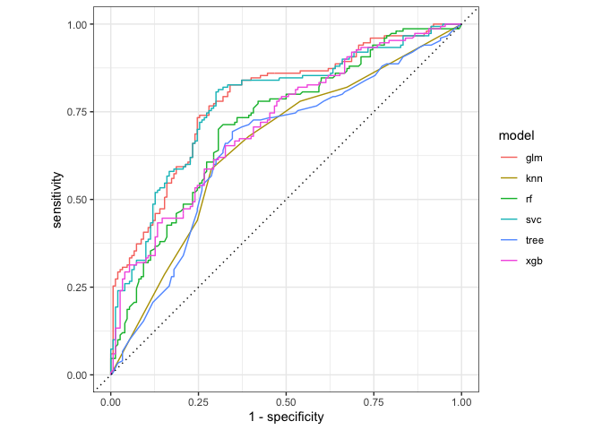

\#Predicting WR Value

Intro
-----

The goal of this project is to use the tidymodels interface in R to
predict a “breakout WR” - without using their draft stock, a notoriously
difficult task. A breakout WR will be defined as any player who
eventually completes a top-24 PPR season (or better) or two (2) top-36
season in the NFL. We will use a dataset going back to only 20212, but
one that has had thousands of features added (through many of them are
aggregations) already.

Because many of the features are aggregations of others, we will be
dealing with highly correlated data, which indicates that Principal
Component Analysis could be useful, particularly for linear models

Load Packages
-------------

    #devtools::install_github("jakesherman/easypackages")
    library(easypackages)

    wr_model_packages = c(
      #Data Import and Data Processing
      "googlesheets4", "tidyverse", "dtplyr","data.table", "lubridate",
       "janitor",
      
      #Data Exploration
      "GGally", "skimr",
      
      #Modelling Workflow
      "tidymodels",
      
      #Model Types
      "ranger", "rpart", "xgboost","kknn", "performance","xgboost","keras", "glmnet", "randomForest","kernlab",
      
      #validation and cleanup
      "workflows", "tune"
      )

    #check for package installation
    packages(wr_model_packages, prompt = T)

    #load all packages
    libraries(wr_model_packages)

Get Data
--------

Let’s also clean some of the names using the janitor package (this
creates a few problems, which we’ll fix with gsub())

    WR_data = read_csv("~/Dropbox/Matt Savoca/Projects/WRmodel_2020/02 - Prepared Data/WR.csv")

    WR_data = WR_data %>%
      clean_names()

    colnames(WR_data) = gsub("t_d", "td", colnames(WR_data))
    colnames(WR_data) = gsub("w_rs", "wrs", colnames(WR_data))
    colnames(WR_data) = gsub("at_ts", "atts", colnames(WR_data))
    colnames(WR_data) = gsub("re_cs", "rec", colnames(WR_data))
    colnames(WR_data) = gsub("f_inishes", "finishes", colnames(WR_data))

Data Wrangling
--------------

First we’ll ensure columns are the right dtype, and then we’ll begin the
process of using “Year-based” metrics instead of “Age-based” nmetrics as
the dataset has.

    WR_pivot = WR_data %>%
      # Adjust Table so that each player-season has it's own row
      select(-contains("over"),-contains("ovr"), -contains("breakout")) %>%
      mutate_at(vars(matches("age_[0-9+]")), funs(as.numeric)) %>%
      mutate_at(vars(matches("career_")), funs(as.numeric)) %>%
      mutate_at(vars(matches("dominator_")), funs(as.numeric)) %>%
      mutate_at(vars(matches("vertical")), funs(as.numeric)) %>%
      pivot_longer(
        cols = contains("_age_", ignore.case = F),
        names_to = c("metric", "age"),
        names_pattern = "([a-zA-Z/_]*)age_([1-2+][0-9+])",
        names_ptypes = list(metric = character(),
                            age = integer()),
        ) %>% 
      pivot_wider(names_from = metric, values_from = value)

Next we’ll use the dplyr package to clean the data, generate a few more
features, and create our target variable, **wr\_type**. A value of “Yes”
indicates a breakout, and “No” indicates no breakout. We’ll also ensure
the dataset only includes one line per player.

    WR_df = WR_pivot %>%
      mutate(
        # Keep the Bama info
        is_alabama = case_when(school == "Alabama" ~ 1, TRUE ~ 0),
        # Keep the OSU info
        is_osu = case_when(school == "Ohio ST" ~ 1, TRUE ~ 0),
        
        #keep the power 5 info
        #is_p5 = case_when(
        #  conf %in% c('Big 12', 'Pac-12', 'SEC', 'Big Ten', 'ACC') ~ 1,
        #  TRUE ~ 0),
        
        
        # numericals to factors
        draft_age = factor(draft_age),
        draft_year = factor(draft_year),
        
        # UDFA to column
        is_udfa = case_when(draft_round == "UDFA" ~ 1, TRUE ~ 0),
        
        # FF thresholds
        top_36 = case_when(nfl_finishes_top_36_wr > 0 ~ 1, TRUE ~ 0),
        top_24 = case_when(nfl_finishes_top_24_wr > 0 ~ 1, TRUE ~ 0),
        top_12 = case_when(nfl_finishes_top_12_wr > 0 ~ 1, TRUE ~ 0),
        
        # Kind of unneccessary, since we'll drop for now
        draft_round = as.numeric(draft_round),
        draft_pick= as.numeric(draft_pick),
        
        # TARGET VARIABLE
        wr_type = factor(case_when(
          top_12 > 0 | top_24 > 0 | 
            top_36 > 1 ~ "Yes", TRUE ~ "No")),
        
        draft_day = factor(case_when(draft_round < 2 ~ 1,
                              draft_round < 4 ~ 2,
                              draft_round < 8 ~ 3,
                              is_udfa == 1 ~ 4,
                              TRUE ~ NA_real_)),
      ) %>% # Step 2 begins...
      filter(is.na(games_played_)==F) %>%
      
      # ONE LINE PER PLAYER 
      group_by(player, school, draft_age) %>%
      mutate(min_age = min(age),
             max_age = max(age),
             year = age-min_age + 1,
             draft_round = factor(draft_round),
             draft_pick= factor(draft_pick)
             ) %>%
      pivot_longer(
        cols = ends_with("_"),
        names_to = "key"
      ) %>%
      mutate(key = paste0(key, "year_", year),
             age = factor(age)) %>%
      ungroup() %>%
      
      
      # create new "Year-based" (rather than age-based) metrics
      # wider is better for typical linear models
      pivot_wider(names_from = key, values_from = value) %>%
      group_by(player, school, draft_year) %>%
      mutate_if(is.numeric, mean, na.rm = T) %>%
      mutate(draft_age_date = mdy(paste0("9/1/", draft_year)),
             dob = mdy(dob),
             draft_age = as.numeric((draft_age_date - dob)/365.25),
             draft_day = as.numeric(draft_day)) %>%
      filter(as.numeric(as.character(age)) == as.numeric(as.character(max_age))) %>%
      ungroup()

Explore Data
------------

I’ll go much faster than I ever would in real-life here, since I wanna
get to the modeling. A shortcut is to use the `skimm()` frunction within
the `skimmr` package.

### Filter unused columns

    WR_filtered = WR_df %>%
      filter(as.numeric(as.character(draft_year)) < 2020) %>%
      select(-draft_year, -top_12, -top_36, -matches("finishes"), 
             -age, -player, -school, -draft_round, -draft_pick, -draft_age, 
             -draft_age_date, -dob, -draft_day)

### Explore - will comment out as image is quite large

    #skimr::skim(WR_filtered)

Model Setup
-----------

    WR_split = initial_split(WR_filtered)
    WR_train = training(WR_split)
    WR_test = testing(WR_split)

    # df for 2020 WRs
    WR_prediction_df = WR_df %>%
      filter(as.numeric(as.character(draft_year)) == 2020)

    WR_thisyear = WR_prediction_df %>%
      select(-draft_year, -top_12, -top_36, -matches("finishes"), 
             -age, -player, -school, -draft_round, -draft_pick, -draft_age, 
             -draft_age_date, -dob, -draft_day)

### Preprocess via `recipes`

An important step, alongside PCA is normalizing the numerical metrics,
and donwsampling wr\_type so that the training data includes the as many
breakout WRs as busts (non-breakout.)

    WR_rec = recipe(wr_type ~ ., data = WR_train) %>%
      step_meanimpute(all_numeric()) %>%
      step_modeimpute(all_nominal(), -all_outcomes()) %>%
      step_zv(all_numeric()) %>%
      step_corr(all_numeric()) %>%
      step_downsample(wr_type) %>%
      step_dummy(all_nominal(), -all_outcomes()) %>%
      step_normalize(all_numeric()) %>%
      step_pca(all_predictors()) %>%
      prep()

    train_proc = recipes::bake(WR_rec, new_data = WR_train)
    test_proc = recipes::bake(WR_rec, new_data = WR_test)
    val_proc = recipes::bake(WR_rec, new_data = WR_thisyear)

Our modeling dataset now looks nothing like our original, and includes
the same amount of No and Yes in our target variable.

    table(juice(WR_rec)$wr_type)

    ## 
    ##  No Yes 
    ##  67  67

Begin Modelling
---------------

We’ll use the models (essentially) out-of-the-box. Each model should
have it’s hyperparamters tuned significantly before finializing results,
but getting the results is what’s fun ¯\_(ツ)\_/¯

### KNN Model

    knn_spec = nearest_neighbor(neighbors = 3) %>%
      set_engine("kknn") %>%
      set_mode("classification")

    knn_fit = knn_spec %>%
      fit(wr_type ~ .,
          data = juice(WR_rec))
      
    knn_fit

    ## parsnip model object
    ## 
    ## Fit time:  10ms 
    ## 
    ## Call:
    ## kknn::train.kknn(formula = formula, data = data, ks = ~3)
    ## 
    ## Type of response variable: nominal
    ## Minimal misclassification: 0.3507463
    ## Best kernel: optimal
    ## Best k: 3

### Decision Tree Model

    tree_spec = decision_tree() %>%
      set_engine("rpart") %>%
      set_mode("classification")

    tree_fit = tree_spec %>%
      fit(wr_type ~ .,
          data = juice(WR_rec))

    tree_fit

    ## parsnip model object
    ## 
    ## Fit time:  10ms 
    ## n= 134 
    ## 
    ## node), split, n, loss, yval, (yprob)
    ##       * denotes terminal node
    ## 
    ##   1) root 134 67 No (0.50000000 0.50000000)  
    ##     2) PC3>=0.8576635 52 11 No (0.78846154 0.21153846) *
    ##     3) PC3< 0.8576635 82 26 Yes (0.31707317 0.68292683)  
    ##       6) PC1>=4.594171 7  0 No (1.00000000 0.00000000) *
    ##       7) PC1< 4.594171 75 19 Yes (0.25333333 0.74666667)  
    ##        14) PC2>=-3.21534 48 17 Yes (0.35416667 0.64583333)  
    ##          28) PC1>=-6.779484 39 17 Yes (0.43589744 0.56410256)  
    ##            56) PC5< -1.269819 12  3 No (0.75000000 0.25000000) *
    ##            57) PC5>=-1.269819 27  8 Yes (0.29629630 0.70370370)  
    ##             114) PC2>=0.003680492 9  3 No (0.66666667 0.33333333) *
    ##             115) PC2< 0.003680492 18  2 Yes (0.11111111 0.88888889) *
    ##          29) PC1< -6.779484 9  0 Yes (0.00000000 1.00000000) *
    ##        15) PC2< -3.21534 27  2 Yes (0.07407407 0.92592593) *

### GLM (Generalized Linear Model)

    # GLM Classification Model ####
    glm_spec = logistic_reg() %>%
      set_engine("glm") %>%
      set_mode("classification")

    glm_fit = glm_spec %>%
      fit(wr_type ~ .,
          data = juice(WR_rec))

    ## Warning: glm.fit: fitted probabilities numerically 0 or 1 occurred

    glm_fit

    ## parsnip model object
    ## 
    ## Fit time:  7ms 
    ## 
    ## Call:  stats::glm(formula = formula, family = stats::binomial, data = data)
    ## 
    ## Coefficients:
    ## (Intercept)          PC1          PC2          PC3          PC4          PC5  
    ##     -0.4024      -0.3482      -0.4805       0.5294      -0.6103      -0.0334  
    ## 
    ## Degrees of Freedom: 133 Total (i.e. Null);  128 Residual
    ## Null Deviance:       185.8 
    ## Residual Deviance: 129   AIC: 141

### Random Forest Model (Decision Trees w/ Resampling)

    rf_spec = rand_forest() %>%
      set_engine("randomForest") %>%
      set_mode("classification")

    rf_fit = rf_spec %>%
      fit(wr_type ~ .,
          data = juice(WR_rec))

    rf_fit

    ## parsnip model object
    ## 
    ## Fit time:  45ms 
    ## 
    ## Call:
    ##  randomForest(x = as.data.frame(x), y = y) 
    ##                Type of random forest: classification
    ##                      Number of trees: 500
    ## No. of variables tried at each split: 2
    ## 
    ##         OOB estimate of  error rate: 27.61%
    ## Confusion matrix:
    ##     No Yes class.error
    ## No  49  18   0.2686567
    ## Yes 19  48   0.2835821

### XGBoost (Extreme Gradient Boosted Trees) Model

    xgb_spec = boost_tree() %>%
      set_engine("xgboost") %>%
      set_mode("classification")

    xgb_fit = xgb_spec %>%
      fit(wr_type ~ .,
          data = juice(WR_rec))

    xgb_fit

    ## parsnip model object
    ## 
    ## Fit time:  16ms 
    ## ##### xgb.Booster
    ## raw: 14.4 Kb 
    ## call:
    ##   xgboost::xgb.train(params = list(eta = 0.3, max_depth = 6, gamma = 0, 
    ##     colsample_bytree = 1, min_child_weight = 1, subsample = 1), 
    ##     data = x, nrounds = 15, verbose = 0, objective = "binary:logistic", 
    ##     nthread = 1)
    ## params (as set within xgb.train):
    ##   eta = "0.3", max_depth = "6", gamma = "0", colsample_bytree = "1", min_child_weight = "1", subsample = "1", objective = "binary:logistic", nthread = "1", silent = "1"
    ## xgb.attributes:
    ##   niter
    ## # of features: 5 
    ## niter: 15
    ## nfeatures : 5

### SVC (Support Vector Classifier)

    svm_spec = svm_poly() %>%
      set_engine("kernlab") %>%
      set_mode("classification")

    svm_fit = svm_spec %>%
      fit(wr_type ~ .,
          data = juice(WR_rec))

    ##  Setting default kernel parameters

    svm_fit

    ## parsnip model object
    ## 
    ## Fit time:  702ms 
    ## Support Vector Machine object of class "ksvm" 
    ## 
    ## SV type: C-svc  (classification) 
    ##  parameter : cost C = 1 
    ## 
    ## Polynomial kernel function. 
    ##  Hyperparameters : degree =  1  scale =  1  offset =  1 
    ## 
    ## Number of Support Vectors : 78 
    ## 
    ## Objective Function Value : -73.835 
    ## Training error : 0.201493 
    ## Probability model included.

(Brief) Cross-Validation
------------------------

Here we use Monte Carlo Cross-Validation with `mc_cv()` function. We’ll
pay careful attention to the ROC\_AUC metric (higher is better, but
values very clsoe to 1 may indicate overfitting or data leakage)

### KNN

    validation_splits = mc_cv(juice(WR_rec), prop = 0.9, strata = wr_type)

    knn_res = fit_resamples(
      wr_type ~ .,
      knn_spec,
      validation_splits,
      control = control_resamples(save_pred = T)
    )

    knn_res %>%
      collect_metrics()

    ## # A tibble: 2 x 5
    ##   .metric  .estimator  mean     n std_err
    ##   <chr>    <chr>      <dbl> <int>   <dbl>
    ## 1 accuracy binary     0.643    25  0.0257
    ## 2 roc_auc  binary     0.693    25  0.0238

### GLM

    glm_res = fit_resamples(
      wr_type ~ .,
      glm_spec,
      validation_splits,
      control = control_resamples(save_pred = T)
    )

    ## ! Resample04: model: glm.fit: fitted probabilities numerically 0 or 1 occurred

    ## ! Resample05: model: glm.fit: fitted probabilities numerically 0 or 1 occurred

    ## ! Resample06: model: glm.fit: fitted probabilities numerically 0 or 1 occurred

    ## ! Resample08: model: glm.fit: fitted probabilities numerically 0 or 1 occurred

    ## ! Resample10: model: glm.fit: fitted probabilities numerically 0 or 1 occurred

    ## ! Resample11: model: glm.fit: fitted probabilities numerically 0 or 1 occurred

    ## ! Resample16: model: glm.fit: fitted probabilities numerically 0 or 1 occurred

    ## ! Resample17: model: glm.fit: fitted probabilities numerically 0 or 1 occurred

    ## ! Resample20: model: glm.fit: fitted probabilities numerically 0 or 1 occurred

    ## ! Resample21: model: glm.fit: fitted probabilities numerically 0 or 1 occurred

    ## ! Resample22: model: glm.fit: fitted probabilities numerically 0 or 1 occurred

    ## ! Resample23: model: glm.fit: fitted probabilities numerically 0 or 1 occurred

    ## ! Resample24: model: glm.fit: fitted probabilities numerically 0 or 1 occurred

    ## ! Resample25: model: glm.fit: fitted probabilities numerically 0 or 1 occurred

    glm_res %>%
      collect_metrics()

    ## # A tibble: 2 x 5
    ##   .metric  .estimator  mean     n std_err
    ##   <chr>    <chr>      <dbl> <int>   <dbl>
    ## 1 accuracy binary     0.74     25  0.0232
    ## 2 roc_auc  binary     0.786    25  0.0279

### Decision Tree

    tree_res = fit_resamples(
      wr_type ~ .,
      tree_spec,
      validation_splits,
      control = control_resamples(save_pred = T)
    )

    tree_res %>%
      collect_metrics()

    ## # A tibble: 2 x 5
    ##   .metric  .estimator  mean     n std_err
    ##   <chr>    <chr>      <dbl> <int>   <dbl>
    ## 1 accuracy binary     0.67     25  0.0195
    ## 2 roc_auc  binary     0.679    25  0.0171

### Random Forest

    rf_res = fit_resamples(
      wr_type ~ .,
      rf_spec,
      validation_splits,
      control = control_resamples(save_pred = T)
    )

    rf_res %>%
      collect_metrics()

    ## # A tibble: 2 x 5
    ##   .metric  .estimator  mean     n std_err
    ##   <chr>    <chr>      <dbl> <int>   <dbl>
    ## 1 accuracy binary     0.683    25  0.0204
    ## 2 roc_auc  binary     0.726    25  0.0239

### XGBoost

    xgb_res = fit_resamples(
      wr_type ~ .,
      xgb_spec,
      validation_splits,
      control = control_resamples(save_pred = T)
    )

    xgb_res %>%
      collect_metrics()

    ## # A tibble: 2 x 5
    ##   .metric  .estimator  mean     n std_err
    ##   <chr>    <chr>      <dbl> <int>   <dbl>
    ## 1 accuracy binary     0.653    25  0.0208
    ## 2 roc_auc  binary     0.711    25  0.0238

### SVC

    svm_res = fit_resamples(
      wr_type ~ .,
      svm_spec,
      validation_splits,
      control = control_resamples(save_pred = T)
    )

    svm_res %>%
      collect_metrics()

    ## # A tibble: 2 x 5
    ##   .metric  .estimator  mean     n std_err
    ##   <chr>    <chr>      <dbl> <int>   <dbl>
    ## 1 accuracy binary     0.73     25  0.02  
    ## 2 roc_auc  binary     0.781    25  0.0276

Evaluate Models
---------------

Tons more to do here as well.

### Generate ROC curve

    rf_res %>%
      unnest(.predictions) %>%
      mutate(model = "rf") %>%
      bind_rows(tree_res %>%
                  unnest(.predictions) %>%
                  mutate(model = "tree")) %>%
      bind_rows(xgb_res %>%
                  unnest(.predictions) %>%
                  mutate(model = "xgb")) %>%
      bind_rows(glm_res %>%
                  unnest(.predictions) %>%
                  mutate(model = "glm")) %>%
      bind_rows(knn_res %>%
                  unnest(.predictions) %>%
                  mutate(model = "knn")) %>%
      bind_rows(svm_res %>%
                  unnest(.predictions) %>%
                  mutate(model = "svc")) %>%
      group_by(model) %>%
      #generate ROC curve
      yardstick::roc_curve(wr_type, .pred_Yes) %>%
      
      #other charts
      #yardstick::pr_curve(wr_type, .pred_Yes) %>%
      #yardstick::gain_curve(wr_type, .pred_Yes) %>%
      
      #plot ROC curve with autoplot()
      autoplot()

Make predictions using XGBoost
------------------------------

Because there has been no hyperparameter tuning, these results will
still be different with each run, so they’re just for fun. We can always
standardied results by using the `set.seed()` function.

    predictions = svm_fit %>%
      predict(new_data = val_proc, type = "prob") %>%
      bind_cols(WR_prediction_df)

    predictions %>% arrange(-.pred_Yes) %>% select(
      .pred_Yes, player, school, conf
    )

    ## # A tibble: 64 x 4
    ##    .pred_Yes player         school       conf    
    ##        <dbl> <chr>          <chr>        <chr>   
    ##  1     0.867 Joe Reed       Virginia     ACC     
    ##  2     0.837 CeeDee Lamb    Oklahoma     Big 12  
    ##  3     0.797 James Proche   SMU          American
    ##  4     0.771 Lynn Bowden    Kentucky     SEC     
    ##  5     0.725 Tyler Johnson  Minnesota    Big Ten 
    ##  6     0.684 Brandon Aiyuk  Arizona ST   Pac-12  
    ##  7     0.664 Aaron Parker   Rhode Island Non-CFB 
    ##  8     0.657 Jerry Jeudy    Alabama      SEC     
    ##  9     0.649 KJ Hamler      Penn ST      Big Ten 
    ## 10     0.641 John Hightower Boise ST     MWC     
    ## # … with 54 more rows
